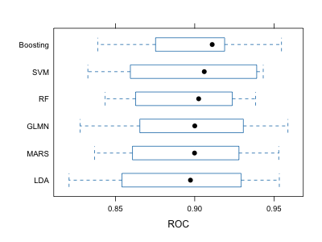

```{r setup, include=FALSE}
knitr::opts_chunk$set(echo = FALSE, warning = FALSE, message = FALSE)
library(dplyr)
library(ggplot2)
library(knitr)

load("severity_test.RData")
load("severity_training.RData")
training_data <- training_data %>%
  janitor::clean_names() %>%
  dplyr::select(-id) %>%
  mutate(severity = case_match(as.numeric(severity),
                               1 ~ "Not Severe",
                               2 ~ "Severe"),
         severity = factor(severity),
         gender = case_match(gender,
                             1 ~ "Male",
                             0 ~ "Female"),
         race = case_match(as.numeric(race),
                           1 ~ "White",
                           2 ~ "Asian",
                           3 ~ "Black",
                           4 ~ "Hispanic"),
         smoking = case_match(as.numeric(smoking),
                              1 ~ "Never",
                              2 ~ "Former",
                              3 ~ "Current"),
         hypertension = case_match(hypertension,
                                   0 ~ "No",
                                   1 ~ "Yes"),
         diabetes = case_match(diabetes,
                               0 ~ "No",
                               1 ~ "Yes"),
         vaccine = case_match(vaccine,
                              0 ~ "Not Vaccinated",
                              1 ~ "Vaccinated")
         )

test_data <- test_data %>%
  janitor::clean_names() %>%
  dplyr::select(-id) %>%
  mutate(severity = case_match(as.numeric(severity),
                               1 ~ "Not Severe",
                               2 ~ "Severe"),
         severity = factor(severity),
         gender = case_match(gender,
                             1 ~ "Male",
                             0 ~ "Female"),
         race = case_match(as.numeric(race),
                           1 ~ "White",
                           2 ~ "Asian",
                           3 ~ "Black",
                           4 ~ "Hispanic"),
         smoking = case_match(as.numeric(smoking),
                              1 ~ "Never",
                              2 ~ "Former",
                              3 ~ "Current"),
         hypertension = case_match(hypertension,
                                   0 ~ "No",
                                   1 ~ "Yes"),
         diabetes = case_match(diabetes,
                               0 ~ "No",
                               1 ~ "Yes"),
         vaccine = case_match(vaccine,
                              0 ~ "Not Vaccinated",
                              1 ~ "Vaccinated")
         )
```


# Introduction
The ongoing COVID-19 pandemic has imposed significant health, economic, and social challenges worldwide. Understanding the factors that contribute to the severity of COVID-19 infections is crucial for managing healthcare resources, tailoring treatments, and improving patient outcomes. This research study, conducted between 2021 and 2023, aims to identify demographic and clinical predictors that influence the severity of COVID-19. By developing a robust predictive model, the study seeks to enhance the prediction of disease severity and offer insights into the key factors that elevate the risk of severe outcomes in infected individuals.

# Exploratory Data Analysis (EDA): 


This study used statistical summaries and visualizations such as box plots and bar charts to understand distributions and relationships within the data.

1. Age (box plot)
Age has shown a distinct distribution between severe and non-severe COVID-19 cases, with older individuals tending to have more severe outcomes. Given the visible difference in the age distributions between severity groups, age is a crucial variable that could help the model capture risk stratification more effectively.

2. SBP (box plot)
The boxplot showing higher SBP in severe COVID-19 cases supports its inclusion, reflecting the impact of cardiovascular health on disease outcomes. High blood pressure is known to compromise vascular integrity and could exacerbate COVID-19 severity.

3. Diabetes (bar plot)
Diabetes has a notable impact on immune system efficiency. The higher proportion of severe cases among diabetics in your data supports the inclusion of this variable, reflecting the metabolic and immune challenges posed by this condition.

4. Vaccine (bar plot)
There’s a significant difference in COVID-19 severity between vaccinated and unvaccinated individuals, as seen in the bar plots. Including vaccination status can help quantify the protective effect of vaccines against severe COVID-19, which is crucial for the model.

5. Age + Height + Weight + BMI + SBP + LDL + Depression (correlation plot)
Age-Related Increases in SBP and LDL: The moderate correlations of age with SBP and LDL highlight common age-related health risks.
Height, Weight, and BMI: The relationships among these three are as expected, with height inversely related to BMI when weight is constant, but weight strongly driving increases in BMI.
BMI and SBP: The strong positive correlation is significant from a health perspective, reinforcing the importance of weight management in controlling or preventing hypertension.
Therefore,  building models could help quantify the impact of these variables on each other, particularly useful for predicting health outcomes based on changes in BMI, SBP, or age.

{ width=50% }

### Model Training: 
For the model training process, various machine learning models were utilized including MARS, GLMN, SVM, Random Forest, LDA, and Boosting. Each model was tuned using a specific grid of hyperparameters to optimize performance, focusing on metrics like ROC AUC to assess and compare model efficacy. The training involved k-fold cross-validation to ensure the models generalized well over different subsets of the data.

{ width=50% }
{ width=50% }
{ width=50% }
{ width=50% }
{ width=50% }

### Results

```{r}
resamp_summary <- read.csv("Roc_summary.csv")
knitr::kable(resamp_summary, caption = "Summary of Resampling Results (ROC)")
```


{ width=40% }


The ROC AUC is a performance measurement for classification problems at various threshold settings. It tells how much model is capable of distinguishing between classes. Higher AUC values indicate better model performance. Boosting has the highest Median ROC AUC (0.9110222) and Mean ROC AUC (0.9007355), indicating it typically performs better than the other models on average. GLMN shows the highest Maximum ROC AUC (0.9587559), suggesting that in its best case, it has the highest discriminative ability. Overall, Boosting seems to be the best choice considering it has the highest median and mean ROC, which indicates robust and consistently high performance across different subsets of the data.


